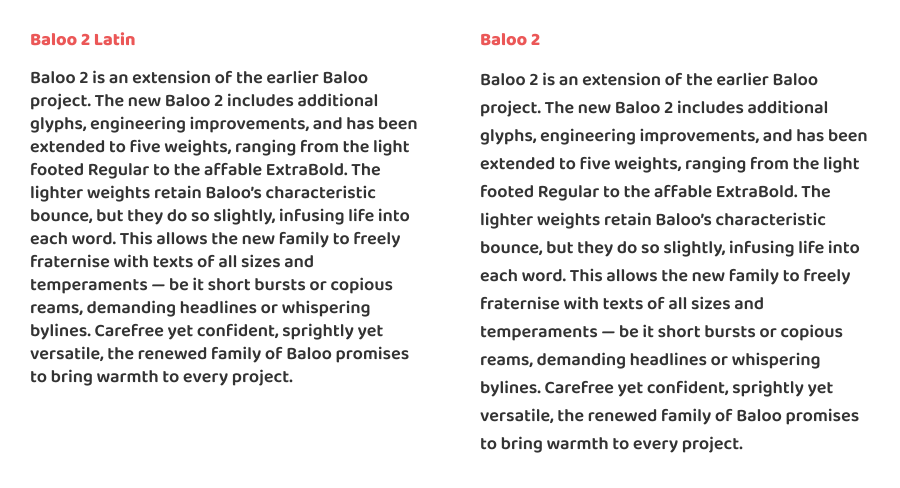

Baloo 2 Latin is a modified version of [Baloo 2 made by Ek Type](https://github.com/EkType/Baloo2). Baloo 2 was designed with Devanagari script in mind hence the taller default metric and does not optimise Latin scripts by default. 

Baloo 2 Latin removes Devanagari glyphs and retains only Latin glyphs. metrics and parameters have been modified to align with [Omnes](https://www.dardenstudio.com/typefaces/omnes_pro#standard). 

Omnes is the primary brand typeface for the Aotearoa New Zealand [Unite against COVID-19](https://covid19.govt.nz/) campaign. Baloo 2 chosen for its similarities with Omnes are used extensively on web and [mobile app](https://apps.apple.com/nz/app/id1511667597) assets with its open sourced licensing nature. 

Baloo 2 Latin was born out of necessity when design file need to be quickly swapped from Omnes to Baloo 2 or vice versa. And when font licensing restrictions are an issue – such as automating dynamic text field generations via a server. 

Default line hight comparison between Baloo 2 Latin and Baloo 2:

